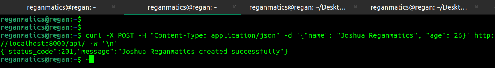
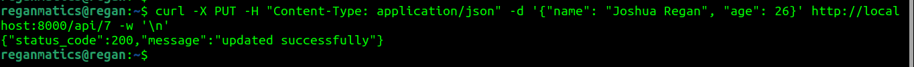

# HNGx2
stage 2 project

# FastAPI CRUD API Project Documentation

This document provides comprehensive step-by-step instructions for setting up and deploying a FastAPI-based CRUD (Create, Read, Update, Delete) API using SQLite as the database backend. This documentation will guide you through every aspect of the project, from environment setup to deployment.

## Project Structure

Before diving into the project setup, let's familiarize ourselves with the project structure:


- `main.py`: Contains the FastAPI application code.
- `persons.db`: SQLite database file to store person records.
- `requirements.txt`: List of project dependencies.
- `DOCUMENTATION.md`: Documentation file where you can record project details.

## Step 1: Environment Setup

### 1.1. Create a Virtual Environment

**clone Repository**
```bash
~ $ git clone <Repo>
~ $ cd <Repo>
```

** create virtual env
```bash
<Repo> $ python3 -m venv venv
```

Create a virtual environment to isolate project dependencies. Open your terminal and run:

```bash
<Repo> $ python -m venv venv
<Repo> $ source venv/bin/activate
```

install packeges in requirements.txt

```bash
(venv) <Repo> $ pip3 install -r requirements.txt
```

## Endpoints
### Create a New Person
**Request:**

- **HTTP Method:** POST
- **Endpoint: /api/**
- **Request Body (JSON):**
```json
{
  "name": "John Doe",
  "age": 30
}
```

**Response:**

- **Status Code:** 201 Created
- **Response Body (JSON):**
```json
{
  "status_code": 201,
  "message": "Person created successfully"
}
```


### Fetch Details of a Person
**Request:**
- **HTTP Method:** GET
- **Endpoint (by User ID):** /api/{user_id}
- **Endpoint (by Name):** /api/{name}
- **URL Parameters:**
	- **user_id (integer) or name (string)**

**Response (by User ID):**

- **Status Code:** 200 OK
- **Response Body (JSON):**
```json
{
  "name": "John Doe",
  "age": 30
}
```

**Response (by Name):**

Status Code: 200 OK
Response Body (JSON):

```json
[
  {
    "name": "John Doe",
    "age": 30
  },
  {
    "name": "John Doe",
    "age": 25
  }
]
```

## Update Details of an Existing Person
**Request:**

- **HTTP Method:** PUT
- **Endpoint:** /api/{user_id}
- **URL Parameter:**
    - **user_id** (integer)
    
- **Request Body (JSON):**
```json
{
  "name": "Updated Name",
  "age": 35
}
```

**Response:**

**Status Code:** 200 OK
**Response Body (JSON):**

```json
{
  "status_code": 200,
  "message": "updated successfully"
}
```

## Delete a Person
**Request:**

- **HTTP Method:** DELETE
- **Endpoint:** /api/{user_id}
- **URL Parameter:**

    - **user_id (integer)**
**Response:**

- **Status Code:** 200 OK
- **Response Body (JSON):**
```json
{
  "status_code": 200,
  "message": "deleted successfully"
}
```


## List All Persons
**Request:**

- **HTTP Method:** GET
- **Endpoint:** /api/

**Response:**

- **Status Code:** 200 OK
- **Response Body (JSON):**

```json
[
  {
    "name": "John Doe",
    "age": 30
  },
  {
    "name": "Jane Smith",
    "age": 25
  }
]
```

## sample usage
ensure the server is running, use the code below

```bash
gunicorn  main:app -k uvicorn.workers --reload
```

### Create a New Person
**Request:**
```bash
curl -X POST -H "Content-Type: application/json" -d '{"name": "Joshua Reganmatics", "age": 26}' http://localhost:8000/api/ -w '\n'
```
**Response**
```json
{
  "status_code": 201,
  "message": "Joshua Reganmatics created successfully"
}
```


### Fetch Details of a Person by User ID
**Request:**
```bash
curl http://localhost:8000/api/7 -w '\n'
```
**Response**
```json
[{
  "name": "Joshua Reganmatics",
  "age": 26
}]
```


### Fetch Details of a Person by Name
**Request:**
```bash
curl http://localhost:8000/api/Joshua%20Reganmatics -w '\n'
```

**Response**
```json
[
  {
    "name": "Joshua Reganmatics",
    "age": 26
  }
]
```


### Update Details of an Existing Person
**Request:**
```bash
curl -X PUT -H "Content-Type: application/json" -d '{"name": "Joshua Regan", "age": 26}' http://localhost:8000/api/7 -w '\n'
```
**Response**
```json
{
  "name": "Joshua Regan",
  "age": 35
}
```


### Delete a Person
**Request:**
```bas
curl -X DELETE http://localhost:8000/api/7 -w '\n'
```
**Response**
```json
{
  "status_code": 200,
  "message": "deleted successfully"
}
```


## Known Limitations and Assumptions

### 1. Multiple Persons with the Same Name

- **Limitation**: The API currently allows multiple persons with the same name to be stored in the database. This may lead to ambiguity when searching for persons by name, as the API returns a list of matching persons.
- **Recommendation**: To avoid confusion, consider using a unique identifier, such as an email address or a combination of name and birthdate, as the primary key if name uniqueness is essential for your use case.

### 2. Limited Security Measures

- **Assumption**: This API provides basic CRUD functionality and minimal security measures. It does not implement advanced security features, such as authentication or authorization.
- **Recommendation**: For production use, it is advisable to implement authentication and authorization mechanisms to secure your API. Consider using third-party authentication providers or frameworks like OAuth2 for enhanced security.

### 3. No Data Validation for Age

- **Assumption**: The API does not perform extensive validation on the `age` field when creating or updating persons. It assumes that age is an integer.
- **Recommendation**: Depending on your requirements, you may want to implement additional validation for the `age` field to ensure it meets specific criteria, such as being within a certain range or a non-negative value.

### 4. Lack of Pagination for List Endpoint

- **Limitation**: The `list_all_persons` endpoint does not implement pagination. If a large number of persons are stored in the database, fetching all of them at once may result in performance issues.
- **Recommendation**: To address this limitation, consider implementing pagination in the `list_all_persons` endpoint, allowing clients to retrieve data in manageable chunks.

These limitations and assumptions should be considered when using the API for your specific use case. Depending on your project requirements, you may need to make adjustments or enhancements to address these issues.

## Setting Up and Deploying the API on Render

Render is a platform that simplifies the deployment of web applications, including FastAPI applications. Follow these steps to set up and deploy your FastAPI API on Render:

### 1. Sign Up for a Render Account

If you don't have a Render account, sign up for one at [Render](https://render.com/).

### 2. Create a New Web Service

1. Log in to your Render account.
2. Click "New" on the dashboard.
3. Select "Web Service" as the type of service to create.

### 3. Configure Your Service

Configure your web service as follows:

- **Environment**: Select the appropriate environment (e.g., Python) for your FastAPI application.
- **Build Command**: Enter `pip install -r requirements.txt`.
- **Start Command**: Enter `gunicorn main:app -k uvicorn.workers.UvicornWorker --reload`
- **Public Port**: Set the public port to `80`.

### 4. Add Environment Variables (Optional)

If your FastAPI application requires environment variables, you can add them in the Render dashboard under the "Environment" section.

### 5. Deploy Your Application

1. Click "Create Web Service" to deploy your FastAPI application.
2. Render will automatically build and deploy your application.
3. Once the deployment is complete, you will receive a unique URL where your API is hosted.

### 6. Access Your API

You can now access your FastAPI API by visiting the provided URL. For example, if Render assigns the URL `https://your-api.onrender.com`, your API endpoints will be available at URLs like `https://your-api.onrender.com/api/`.

### 7. Testing Your API

Test your API endpoints using tools like `curl` or Postman, as described in the documentation's "Sample Usage" section.

### 8. Managing Your Render Service

You can manage your Render service, view logs, and make updates directly from the Render dashboard.

Congratulations! Your FastAPI API is now deployed and accessible on Render. You can further customize your deployment and configure custom domains as needed.
